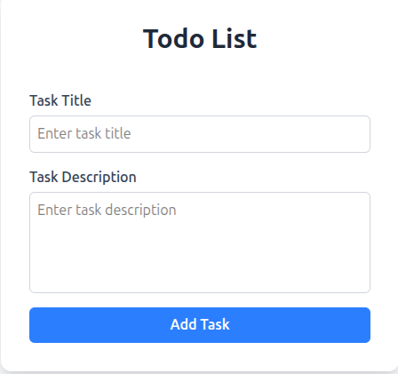
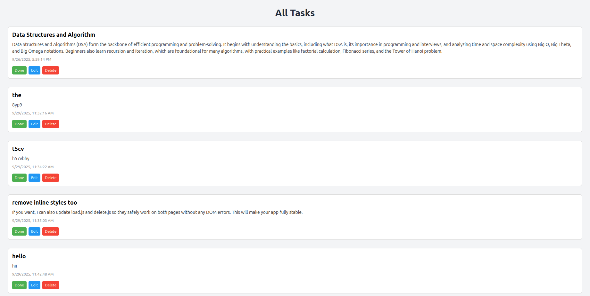

MyTodo List

A simple Todo List web application built with HTML, JavaScript, and CSS. This app allows users to add, edit, delete, and mark tasks as done, with tasks persisted in localStorage. Tasks are displayed on a separate page, and the form is pre-filled when editing a task.

---

Features

Add new tasks with title and description

View all tasks on a separate task page

Edit tasks with form pre-filled values

Delete tasks

Mark tasks as Done/Undone

Persist tasks using localStorage

Responsive and user-friendly UI with CSS styling

Demo

You can view your tasks immediately by opening index.html in a browser.
After adding a task, you’ll be redirected to task.html to see all tasks.

File Structure

```
MyTodoList/
├─ index.html          # Main page with form to add tasks
├─ task.html           # Page displaying all tasks
├─ CSS/
│  └─ style.css        # External stylesheet
├─ JS/
│  ├─ app.js           # Main JS logic for form and storage
│  ├─ create.js        # Function to add tasks
│  ├─ load.js          # Function to render tasks
│  ├─ delete.js        # Function to delete tasks
│  └─ update.js        # Function to update tasks (optional)
└─ README.md           # Project documentation
```


Technologies Used

HTML5 – structure of the app

CSS3 – styling (with classes and optional Tailwind CSS)

JavaScript (ES6 Modules) – add, edit, delete, render tasks

LocalStorage – persist tasks between sessions

Usage

Clone the repository: 
```
git clone https://github.com/yourusername/MyTodoList.git
```

Open index.html in your web browser.

Add a task using the form.

View tasks on task.html.

Edit or delete tasks as needed.

Screenshots

Add Task Form:


Task List Page:

```
**Add Task Form:**  


**Task List Page:**  



```

Future Improvements

Add due dates and priority levels

Add search and filter functionality

Integrate with a backend for multi-user support

Add drag-and-drop sorting of tasks

License

This project is open-source and free to use.
